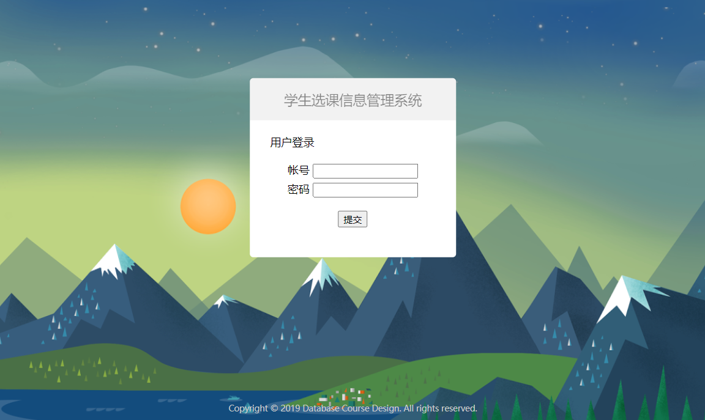
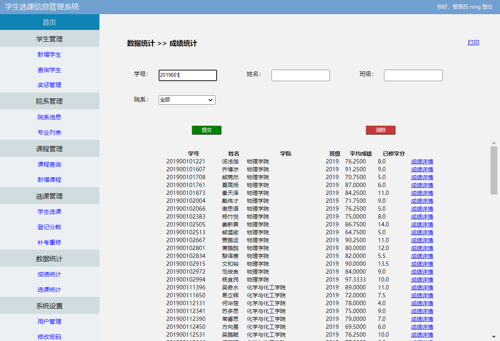

## 学生选课信息管理系统
##### 使用手册
###### 2019年12月

#### 简介
本套学生选课信息管理系统基于PHP7 / MySQL编写，部署简易，功能强大，上手简单。
系统可以准确地记录和查询学生信息，包括学生的姓名、单位、年龄、性别以及身份证号码等。
系统可以准确地记录学生地每一次奖惩情况。
系统可以对学校的院系情况进行管理，包括设置学院名称、修改某学院某专业方向的名称等。
系统可以对基础数据进行维护。
系统能够对开设的课程进行管理
学生选课管理、考试（登记分数）、补考重修管理
提供强大数据统计、查询、报表生成以及打印等功能。
用户权限管理
异常处理
 
#### 安装
确保要部署的机器上已经安装好主流版本的PHP/MySQL，配置好了Web服务器，已将管理系统源码文件复制到要部署的目录中，赋予需要的文件权限。建好数据库，赋予数据库用户需要的读写权限。

可以导入精简示例数据 example_lite.sql 或按下面步骤进行全新安装。

在 PHP7.2 + MYSQL5.6 及 PHP7.4 + MySQL8.0 下测试通过。

###### 执行建表命令

```sql

SET NAMES utf8;
SET time_zone = '+00:00';
SET foreign_key_checks = 0;
SET sql_mode = 'NO_AUTO_VALUE_ON_ZERO';

DROP TABLE IF EXISTS `course`;
CREATE TABLE `course` (
  `cid` char(6) DEFAULT NULL,
  `cname` varchar(15) DEFAULT NULL,
  `credit` decimal(2,1) DEFAULT NULL,
  `cadd` varchar(20) DEFAULT NULL,
  `did` char(2) DEFAULT NULL,
  `tname` varchar(15) DEFAULT NULL,
  UNIQUE KEY `cid_2` (`cid`),
  KEY `cid` (`cid`)
) ENGINE=InnoDB DEFAULT CHARSET=utf8;


DROP TABLE IF EXISTS `department`;
CREATE TABLE `department` (
  `did` char(2) DEFAULT NULL,
  `dname` varchar(15) NOT NULL,
  `dadd` varchar(30) DEFAULT NULL,
  `dmng` varchar(10) DEFAULT NULL,
  `dtel` varchar(15) DEFAULT NULL,
  UNIQUE KEY `did_2` (`did`),
  KEY `did` (`did`)
) ENGINE=InnoDB DEFAULT CHARSET=utf8;


DROP TABLE IF EXISTS `major`;
CREATE TABLE `major` (
  `did` char(2) DEFAULT NULL,
  `mname` varchar(20) DEFAULT NULL,
  UNIQUE KEY `did_2` (`did`,`mname`),
  KEY `did` (`did`)
) ENGINE=InnoDB DEFAULT CHARSET=utf8;


DROP TABLE IF EXISTS `student`;
CREATE TABLE `student` (
  `sid` char(12) NOT NULL,
  `name` varchar(10) NOT NULL,
  `sex` char(1) NOT NULL,
  `age` varchar(3) DEFAULT NULL,
  `class` varchar(10) DEFAULT NULL,
  `idnum` char(18) DEFAULT NULL,
  `did` char(2) DEFAULT NULL,
  `email` char(30) DEFAULT NULL,
  `tel` char(11) DEFAULT NULL,
  PRIMARY KEY (`sid`),
  UNIQUE KEY `sid` (`sid`)
) ENGINE=InnoDB DEFAULT CHARSET=utf8;


DROP TABLE IF EXISTS `student_course`;
CREATE TABLE `student_course` (
  `sid` char(12) NOT NULL,
  `cid` char(6) NOT NULL,
  `score` int(3) DEFAULT NULL,
  `status` char(1) DEFAULT NULL,
  KEY `sid` (`sid`),
  KEY `cid` (`cid`)
) ENGINE=InnoDB DEFAULT CHARSET=utf8;


DROP TABLE IF EXISTS `student_log`;
CREATE TABLE `student_log` (
  `sid` varchar(12) DEFAULT NULL,
  `type` char(1) DEFAULT NULL,
  `reason` varchar(30) DEFAULT NULL,
  `detail` varchar(100) DEFAULT NULL,
  `logdate` date DEFAULT NULL,
  `addtime` datetime DEFAULT NULL,
  KEY `sid` (`sid`)
) ENGINE=InnoDB DEFAULT CHARSET=utf8;


DROP TABLE IF EXISTS `user_admin`;
CREATE TABLE `user_admin` (
  `adminID` varchar(15) DEFAULT NULL,
  `adminName` varchar(15) DEFAULT NULL,
  `pwd` char(32) DEFAULT NULL,
  KEY `adminID` (`adminID`)
) ENGINE=InnoDB DEFAULT CHARSET=utf8;


DROP TABLE IF EXISTS `user_student`;
CREATE TABLE `user_student` (
  `sid` char(12) NOT NULL,
  `pwd` char(32) DEFAULT NULL,
  UNIQUE KEY `sid` (`sid`),
  KEY `sid_2` (`sid`)
) ENGINE=InnoDB DEFAULT CHARSET=utf8;
```


新建管理员账户，在表 user_admin 中新建一行记录，adminID 为管理员ID，adminName 为管理员姓名，pwd为MD5加密后的密码。
实例代码如下（通用的admin）：
``` sql
INSERT INTO `user_admin` (`adminID`, `adminName`, `pwd`) VALUES
('admin', 'A先生', '21232f297a57a5a743894a0e4a801fc3');
```

然后，修改 ./config/database.php 中的数据库连接信息。基于 PHP 的开源单页数据库管理程序 [Adminer](https://github.com/vrana/adminer/) 可以助你便捷管理数据库。
 
#### 功能介绍
学生管理
- 新增学生，输入所有需要的信息，点击提交即可新增学生记录。
- 查询学生，输入要搜索的信息，点击搜索即可模糊搜索。
- 在搜索结果中，点击修改可以修改学生信息
- 点击删除可以删除该学生

奖惩管理
- 输入相应信息可以模糊搜索
- 在搜索结果中点击修改可以修改指定的记录，点击删除可以删除记录。
- 在奖惩管理页面点击新增可以给指定学生新增奖惩记录

院系管理
- 显示院系信息后，单击后面的“修改”即可修改院系信息
- 输入修改的信息后，单击“修改信息”即可提交修改的院系信息
- 在提交之前，单击“返回”就可以清除掉文本框内还没有提交的内容并返回到上一级页面
- 选择专业列表就可以进入专业列表界面
- 输入相关的信息，单击“提交”就可以查询专业
- 显示专业信息后，单击“改”即可更改专业
- 显示专业信息后，单击“删”即可删除专业
- 单击“新增专业”即可新增专业

课程管理
- 选择课程查询就可以进入课程查询界面，输入相关的信息，单击“提交”就可以新增课程
- 显示课程信息后，单击后面的“删除”即可删除课程信息
- 选择新增课程就可以进入新增课程界面，输入相关的信息，单击“提交”就可以新增课程，如果没有输入正确的信息，系统会出现错误提示

选课管理
- 选择学生选课就可以进入学生选课界面，输入相关的信息，单击“提交”就可以查询学生选课
- 显示相关信息后，单击“退选”即可退选课程
- 选择登录分数就可以进入登录分数界面，输入相关的信息，单击“提交”就可以登记分数
- 显示成绩信息后，单击“登记成绩”即可录入成绩
- 选择补考重修就可以进入补考重修界面，输入相关的信息，单击“提交”就可以更新重修信息

数据统计
- 选择成绩统计就可以进入成绩统计界面，输入相关的信息，单击“提交”就可以查询成绩
- 点击“成绩详情”即可查看每一门课的成绩情况
- 单击“打印”即可打印成绩表
- 选择选课统计就可以进入选课统计界面
- 输入相关的信息，单击“提交”就可以选课情况
- 单击“详情”即可查看课程详情
- 单击“打印”即可打印课程情况

系统设置
- 选择用户管理就可以进入用户管理界面
- 输入相关的信息，单击“提交”就可以查找学生
- 显示学生信息后，单击后面的“学生详情”即可查看学生信息
- 显示学生信息后，单击后面的“重置密码”即可重置密码
- 输入修改的信息后，单击“修改信息”即可提交修改的学生信息
- 选择修改密码就可以进入修改密码界面，输入相关的信息，单击“提交”就可以更新密码


#### 运行截图







With the help of @carbonium14

